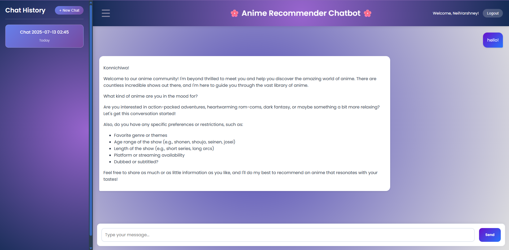

# Anime Recommender Chatbot

A beautiful, full-featured anime recommendation chatbot with user authentication, chat history, and a stunning anime-themed UI.

## Screenshots

### Dashboard Page


### Login Page


### Register Page


## Features

### User Authentication
- **Secure Registration & Login**: JWT-based authentication with password hashing
- **User Profiles**: Personalized experience with user-specific chat history
- **Session Management**: Automatic token refresh and secure logout

### Chat Features
- **AI-Powered Recommendations**: Powered by Groq's Llama 3.1 model
- **Real-time Typing Animation**: Smooth character-by-character response animation
- **Markdown Support**: Rich text formatting for better readability
- **Conversation Management**: Create, view, and delete chat conversations

### Modern UI/UX
- **Anime Aesthetic**: Beautiful gradients, floating elements, and anime-inspired design
- **Responsive Design**: Works perfectly on desktop and mobile devices
- **Smooth Animations**: Elegant transitions and hover effects
- **Dark/Light Theme**: Eye-friendly color schemes

### Chat History
- **Persistent Storage**: All conversations saved in SQLite database
- **Easy Navigation**: Sidebar with conversation list and quick access
- **Smart Organization**: Conversations sorted by last activity
- **Quick Actions**: Delete conversations with confirmation

## Quick Start

### Prerequisites
- Python 3.8+
- Node.js 16+
- Groq API key

### Backend Setup

1. **Navigate to backend directory**:
   ```bash
   cd backend
   ```

2. **Install Python dependencies**:
   ```bash
   pip install -r requirements.txt
   ```

3. **Set up environment variables**:
   Create a `.env` file in the backend directory:
   ```env
   GROQ_API_KEY=your_groq_api_key_here
   SECRET_KEY=your_secret_key_for_jwt_tokens
   ```

4. **Run the backend server**:
   ```bash
   python app.py
   ```
   The server will start on `http://localhost:8000`

### Frontend Setup

1. **Navigate to frontend directory**:
   ```bash
   cd frontend
   ```

2. **Install Node.js dependencies**:
   ```bash
   npm install
   ```

3. **Start the development server**:
   ```bash
   npm start
   ```
   The app will open on `http://localhost:3000`

## Architecture

### Backend (FastAPI)
- **Authentication**: JWT tokens with bcrypt password hashing
- **Database**: SQLite with proper relational schema
- **API**: RESTful endpoints for chat, conversations, and user management
- **AI Integration**: Groq API for intelligent anime recommendations

### Frontend (React)
- **State Management**: React Context for authentication
- **Routing**: React Router with protected routes
- **Styling**: Custom CSS with anime-themed design
- **Real-time Features**: WebSocket-like experience with smooth animations

## UI Components

### Authentication Pages
- **Login**: Beautiful form with floating anime elements
- **Register**: User-friendly registration with validation
- **Loading States**: Smooth transitions and feedback

### Dashboard
- **Sidebar**: Conversation history with quick actions
- **Chat Interface**: Modern messaging with typing indicators
- **Welcome Screen**: Helpful suggestions for new users
- **User Info**: Display current user and logout option

### Modals & Overlays
- **New Chat Modal**: Create conversations with custom titles
- **Confirmation Dialogs**: Safe deletion with user confirmation


## Usage Examples

### Getting Started
1. Register a new account or login
2. Click the sidebar icon to view chat history
3. Start a new conversation or continue an existing one
4. Ask for anime recommendations!

### Sample Prompts
- "I'm looking for action anime with great animation"
- "Recommend me some romance anime"
- "What are some must-watch classics?"
- "I like psychological thrillers, what should I watch?"
- "Show me anime similar to Attack on Titan"

## Security Features

- **Password Hashing**: bcrypt for secure password storage
- **JWT Tokens**: Secure authentication with expiration
- **Input Validation**: Server-side validation for all inputs
- **SQL Injection Protection**: Parameterized queries
- **CORS Configuration**: Proper cross-origin settings


## Contributing

1. Fork the repository
2. Create a feature branch
3. Make your changes
4. Add tests if applicable
5. Submit a pull request


### Troubleshooting
- If you encounter issues with missing dependencies, re-run `pip install -r requirements.txt` in `backend/` and `npm install` in `frontend/`.
- If you see unexpected files, check your `.gitignore` and clean up as needed.

---


